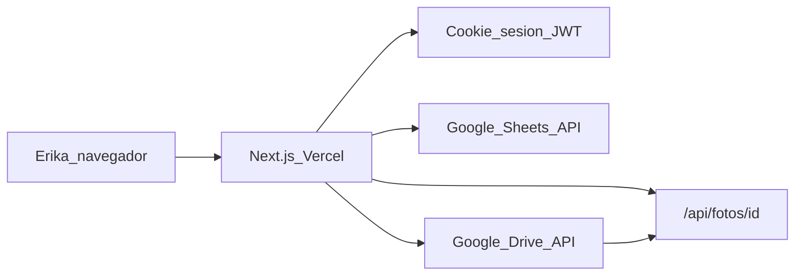

# AGENTS.md — Inventario de joyas

Contexto para agentes de IA que trabajen en este repositorio.

## Resumen del proyecto

Aplicación web para administrar un inventario de joyas. El frontend permite gestionar piezas (alta, edición, baja, búsqueda, filtros y fotos). Los datos se persisten en **Google Sheets** y las fotos en **Google Drive**. El despliegue está pensado para **Vercel**; el código vive en **GitHub**.

- **Usuario de acceso:** `Erika` (configurado con `AUTH_USERNAME`)
- **Contraseña:** fija, solo en variables de entorno (`AUTH_PASSWORD`), nunca en el código ni en Git
- **Idioma de la UI:** español
- **Estética:** joyería (tipografía Playfair Display + DM Sans, tonos crema/dorado)

## Recursos externos

| Recurso | ID / URL |
|---------|----------|
| Google Sheets (inventario) | `1PswT8PYMbdPsAkAlvBWmrhsQ4mSpvDctfAl1S6cJtkc` |
| Hoja de cálculo | https://docs.google.com/spreadsheets/d/1PswT8PYMbdPsAkAlvBWmrhsQ4mSpvDctfAl1S6cJtkc/edit |
| Google Drive (fotos) | `17B8KwnchF5ne68xID0e5pJ2Octk2ZYJ4` |
| Carpeta de fotos | https://drive.google.com/drive/folders/17B8KwnchF5ne68xID0e5pJ2Octk2ZYJ4 |
| Repositorio GitHub | https://github.com/alvaroraulcastro/inventarioJoyas.git |

Google Sheets **no almacena fotos**. En la hoja solo se guarda `foto_id` (ID del archivo en Drive). El archivo físico va a la carpeta de Drive.

## Arquitectura



1. El usuario inicia sesión en `/login` con credenciales fijas.
2. La API valida y emite una cookie httpOnly firmada con JWT (`jose`).
3. `proxy.ts` protege rutas: sin sesión válida redirige a `/login` (o 401 en API).
4. CRUD de piezas lee/escribe filas en la pestaña `Inventario` de Google Sheets.
5. Las fotos se suben a Drive; la hoja guarda `foto_id`.
6. Las imágenes se sirven vía `/api/fotos/[id]` (proxy autenticado desde Drive), no con enlaces públicos.

## Stack tecnológico

| Capa | Tecnología |
|------|------------|
| Framework | Next.js 16 (App Router, Turbopack en dev) |
| Lenguaje | TypeScript |
| UI | React 19, Tailwind CSS 4 |
| Auth | Cookie httpOnly + JWT (`jose`) |
| Google | `googleapis` (Sheets + Drive) |
| Deploy | Vercel |
| Runtime API | Node.js (`export const runtime = "nodejs"` en rutas API) |

## Estructura del repositorio

```
app/
  layout.tsx              # Layout raíz, fuentes, metadata
  page.tsx                # Página principal (inventario)
  globals.css             # Estilos globales y tema joyería
  login/page.tsx          # Pantalla de login
  api/
    auth/login/route.ts   # POST login
    auth/logout/route.ts  # POST logout
    piezas/route.ts       # GET listar, POST crear
    piezas/[id]/route.ts  # GET, PUT, DELETE una pieza
    piezas/[id]/foto/route.ts  # POST subir foto
    fotos/[id]/route.ts   # GET stream de imagen desde Drive

components/
  LoginForm.tsx           # Formulario de login (client)
  InventoryList.tsx       # Listado, filtros, acciones (client)
  PieceForm.tsx           # Modal alta/edición con foto (client)

lib/
  types.ts                # Tipos, constantes, esquema de columnas
  auth.ts                 # Validación credenciales, sesión, cookies
  auth-constants.ts       # SESSION_COOKIE (compartido con proxy)
  google.ts               # Cliente JWT y factories Sheets/Drive
  sheets.ts               # CRUD en Google Sheets
  drive.ts                # Subida, borrado y lectura de fotos
  api.ts                  # Helper jsonError para rutas API
  format.ts               # Formato moneda y etiquetas UI

proxy.ts                  # Protección de rutas (Next.js 16: reemplaza middleware)
next.config.ts            # serverExternalPackages: googleapis
.env.example              # Plantilla de variables (sin secretos)
```

## Pantallas

| Ruta | Descripción |
|------|-------------|
| `/login` | Usuario y contraseña. Sin sesión, el resto redirige aquí. |
| `/` | Listado en tarjetas: foto, código, nombre, tipo, estado, precio. Búsqueda y filtros por tipo/estado. Botón "Nueva pieza". |
| Modal alta/edición | Formulario con todos los campos + subida de foto. Reemplazar foto borra la anterior en Drive. |
| Eliminar | Confirmación; borra fila en Sheets y archivo en Drive. |

## API (requieren sesión excepto login)

| Método | Ruta | Acción |
|--------|------|--------|
| POST | `/api/auth/login` | Iniciar sesión |
| POST | `/api/auth/logout` | Cerrar sesión |
| GET | `/api/piezas` | Listar piezas |
| POST | `/api/piezas` | Crear pieza |
| GET | `/api/piezas/[id]` | Obtener una pieza |
| PUT | `/api/piezas/[id]` | Actualizar pieza |
| DELETE | `/api/piezas/[id]` | Eliminar pieza y su foto |
| POST | `/api/piezas/[id]/foto` | Subir/reemplazar foto (multipart `foto`) |
| GET | `/api/fotos/[id]` | Servir imagen desde Drive |

Rutas públicas (sin sesión): `/login`, `/api/auth/login`.

## Esquema de datos — pestaña `Inventario`

Si la hoja está vacía, `ensureInventarioSheet()` crea la pestaña y escribe estos encabezados:

| Columna | Descripción |
|---------|-------------|
| `id` | UUID |
| `codigo` | Código interno / SKU |
| `nombre` | Nombre de la pieza (obligatorio) |
| `tipo` | anillo, collar, pulsera, aretes, dije, reloj, otro |
| `material` | oro, plata, platino, acero, otro |
| `kilates` | Ej. 18k, 14k, 925 |
| `peso_gramos` | Peso en gramos |
| `talla` | Talla |
| `piedras` | Descripción de piedras |
| `precio_costo` | Precio de costo |
| `precio_venta` | Precio de venta |
| `estado` | disponible, reservado, vendido, consignacion |
| `ubicacion` | Ubicación física |
| `fecha_ingreso` | Fecha ISO (YYYY-MM-DD) |
| `foto_id` | ID del archivo en Google Drive |
| `notas` | Notas libres |
| `actualizado_en` | Timestamp ISO de última modificación |

Constantes y tipos en `lib/types.ts`. Etiquetas en español en `TIPO_LABELS`, `MATERIAL_LABELS`, `ESTADO_LABELS`.

## Variables de entorno

Ver `.env.example`. Nunca commitear `.env`, `.env.local` ni JSON de cuenta de servicio.

```bash
AUTH_USERNAME=Erika
AUTH_PASSWORD=                    # Contraseña fija del usuario
AUTH_SECRET=                      # Cadena aleatoria larga para firmar JWT
GOOGLE_SHEET_ID=1PswT8PYMbdPsAkAlvBWmrhsQ4mSpvDctfAl1S6cJtkc
GOOGLE_DRIVE_FOLDER_ID=17B8KwnchF5ne68xID0e5pJ2Octk2ZYJ4
GOOGLE_SERVICE_ACCOUNT_EMAIL=     # Email de la cuenta de servicio
GOOGLE_PRIVATE_KEY=               # Clave privada del JSON (con \n escapados)
```

Generar `AUTH_SECRET`:

```bash
node -e "console.log(require('crypto').randomBytes(32).toString('hex'))"
```

## Requisito previo: cuenta de servicio de Google

Sin esto la app no puede leer ni escribir en Sheets/Drive.

1. Crear proyecto en Google Cloud.
2. Activar **Google Sheets API** y **Google Drive API**.
3. Crear cuenta de servicio y descargar JSON.
4. Compartir la **hoja** y la **carpeta de Drive** con el email `...@....iam.gserviceaccount.com` como **Editor**.
5. El permiso "cualquiera con el enlace" **no alcanza**; la cuenta de servicio tiene identidad propia.

## Autenticación

- Credenciales validadas en `lib/auth.ts` con comparación segura (`timingSafeEqual`).
- Sesión: JWT en cookie `inventario_sesion` (httpOnly, sameSite lax, secure en producción).
- Duración: 7 días.
- `proxy.ts` verifica el JWT con `jose` antes de permitir acceso.
- `lib/auth-constants.ts` exporta `SESSION_COOKIE` para uso en proxy sin importar `node:crypto`.

## Fotos

- Formatos permitidos: JPG, PNG, WEBP, GIF.
- Tamaño máximo: 4 MB.
- Subida: `lib/drive.ts` → carpeta `GOOGLE_DRIVE_FOLDER_ID`.
- Nombre de archivo: `{piezaId}-{timestamp}.{ext}`.
- Al reemplazar foto se borra la anterior en Drive.
- Visualización: `/api/fotos/[id]` (requiere sesión).

## Comandos de desarrollo

```bash
npm install
npm run dev      # http://localhost:3000 (Turbopack)
npm run build
npm run start
npm run lint
```

## Deploy en Vercel

1. Importar repo de GitHub (framework: Next.js).
2. Configurar las mismas variables de entorno que `.env.example`.
3. Desplegar.
4. Probar: login, alta con foto, edición, filtros, verificar fila en Sheets y archivo en Drive.

## Seguridad — reglas para agentes

- **No** hardcodear contraseñas, `AUTH_SECRET` ni claves de Google en el código.
- **No** commitear `.env`, `.env.local`, `credentials.json` ni `*service-account*.json`.
- Proteger `/`, `/api/piezas*` y `/api/fotos*` vía `proxy.ts`.
- Restringir permisos de la carpeta Drive en producción (solo cuenta de servicio + usuario humano).
- Las rutas API usan `requireSession()`; errores de auth devuelven 401.

## Convenciones de código

- App Router de Next.js, sin directorio `src/`.
- Componentes interactivos: `"use client"` en `components/`.
- Lógica de negocio y Google APIs: `lib/` (servidor).
- Rutas API: `export const runtime = "nodejs"` (googleapis no corre en Edge).
- `next.config.ts`: `serverExternalPackages: ["googleapis"]`.
- UI en español; mensajes de error claros para el usuario.
- Cambios mínimos y enfocados; seguir patrones existentes en `lib/` y `components/`.
- No editar el archivo de plan en `.cursor/plans/` salvo que el usuario lo pida.

## Notas técnicas

- **Next.js 16:** `middleware.ts` está deprecado; este proyecto usa `proxy.ts` con `export function proxy`.
- **next.config.ts** tiene `agentRules: false` para no regenerar AGENTS.md automáticamente.
- Si faltan variables de Google, `/api/piezas` devuelve 500 con mensaje explicativo.
- `lib/api.ts` traduce errores comunes de Google (permisos, clave inválida) a mensajes en español.
- Moneda formateada en CLP (`lib/format.ts`); ajustar si cambia la región.

## Flujo típico: crear pieza con foto

1. Usuario abre modal "Nueva pieza" y completa el formulario.
2. `POST /api/piezas` → `createPieza()` escribe fila en Sheets (sin foto aún).
3. Si hay archivo, `POST /api/piezas/[id]/foto` → sube a Drive y actualiza `foto_id` en la fila.
4. El listado muestra la imagen vía `/api/fotos/{foto_id}`.

## Estado actual

La aplicación está implementada según el plan original. Pendiente de configuración por el usuario:

- Cuenta de servicio de Google Cloud
- Variables `GOOGLE_SERVICE_ACCOUNT_EMAIL` y `GOOGLE_PRIVATE_KEY` en local y Vercel
- Compartir hoja y carpeta Drive con la cuenta de servicio

Para más detalle de setup humano, ver `README.md`.

## Skills recomendadas

Para agentes y desarrolladores: ver [`docs/skills.md`](docs/skills.md) — skills ya instaladas, integradas en Cursor y recomendadas desde skills.sh (deploy Vercel, Next.js, seguridad, pruebas, accesibilidad).
